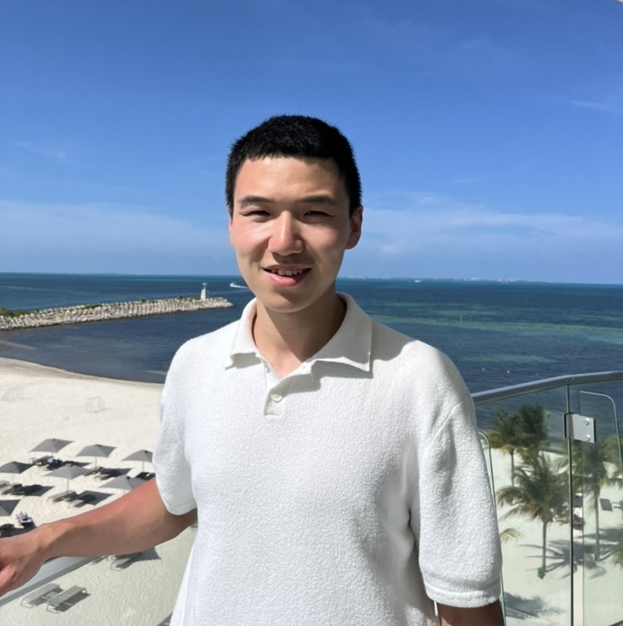

<table>
  <tr>
    <td>
      
    </td>
    <td>
      <b>Xiyuan Wei</b>
       Ph.D. Student
       Department of Computer Science and Engineering
       Texas A&M University
       College Station, Texas
    </td>
  </tr>
</table>

## About Me

Hello! I am Xiyuan Wei (魏希源). I am a fourth-year Ph.D. student at Texas A&M University,
advised by [Prof. Tianbao Yang](http://people.tamu.edu/~tianbao-yang/).
I received my bachelor degree from Nanjing University of Information Science and Technology in 2022.
My research interest lies in Machine Learning.

**Some Links**:
- Email: x{my_last_name}@tamu.edu
- [GitHub](https://github.com/xywei00)
- [Google Scholar](https://scholar.google.com/citations?user=7iGaeB0AAAAJ&hl=en)
- [LinkedIn](https://www.linkedin.com/in/xiyuan-wei-21378229a/)

## Publications

(Asterisk denotes equal contribution)
- Advancing Interpretability of CLIP Representations with Concept Surrogate Model.
  [[abs](https://openreview.net/forum?id=KxoPiQ03BT)]
   Nhat Hoang-Xuan, **Xiyuan Wei**, Wanli Xing, Tianbao Yang, My T. Thai
   *39th Conference on Neural Information Processing Systems* (**NeurIPS**), 2025.
- Model Steering: Learning with a Reference Model Improves Generalization Bounds and Scaling Laws.
  [[abs](https://proceedings.mlr.press/v267/wei25f.html)]
  [[code](https://github.com/Optimization-AI/DRRho-CLIP)]
   **Xiyuan Wei**, Ming Lin, Fanjiang Ye, Fengguang Song, Liangliang Cao, My T. Thai, Tianbao Yang.
   *Proceedings of the 42nd International Conference on Machine Learning* (**ICML Spotlight**), 2025.
- FastCLIP: A Suite of Optimization Techniques to Accelerate CLIP Training with Limited Resources.
  [[abs](https://arxiv.org/abs/2407.01445)]
  [[code](https://github.com/Optimization-AI/fast_clip)]
   **Xiyuan Wei**, Fanjiang Ye, Ori Yonay, Xingyu Chen, Baixi Sun, Dingwen Tao, Tianbao Yang.
   *arXiv preprint*, 2024.
- Stability and Generalization of Stochastic Compositional Gradient Descent Algorithms.
  [[abs](https://proceedings.mlr.press/v235/yang24ad.html)]
   Ming Yang\*, **Xiyuan Wei**\*, Tianbao Yang, Yiming Ying.
   *Proceedings of the 41st International Conference on Machine Learning* (**ICML**), 2024.
- Black-Box Reductions for Zeroth-Order Gradient Algorithms to Achieve Lower Query Complexity.
  [[abs](https://jmlr.org/papers/v22/20-611.html)]
   Bin Gu, **Xiyuan Wei**, Shangqian Gao, Ziran Xiong, Cheng Deng, Heng Huang.
   *Journal of Machine Learning Research* (**JMLR**), 2021.

(Last updated: )
